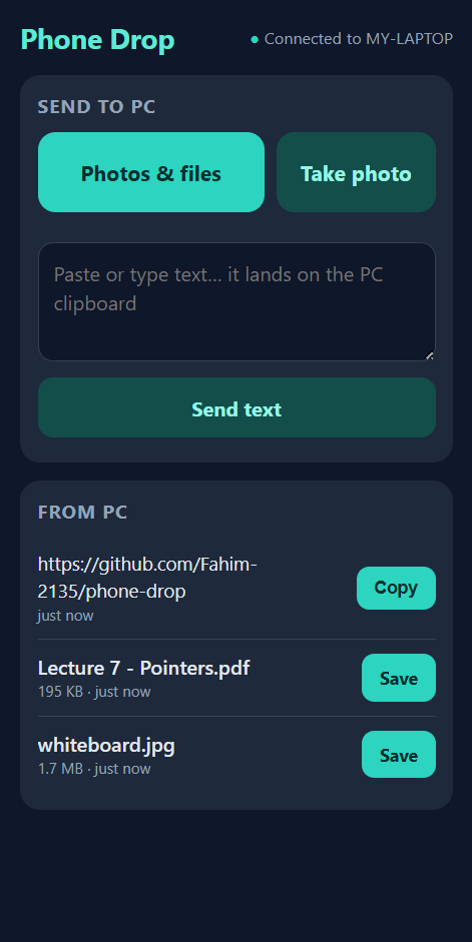
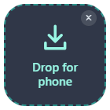

# Phone Drop

**Stop messaging yourself.** Send photos, files and text between your phone and your Windows PC over Wi-Fi. No app to install on the phone, no account, and your files never touch the internet.

<p>
  
  &nbsp;&nbsp;
  
</p>

- **Phone → PC:** pick photos or files (or take a photo) and they land in `Downloads\Phone Drop`. Paste text and it lands on the PC clipboard.
- **PC → phone:** drag files or text onto the little drop box, or right-click a file → **Send to → Phone (Phone Drop)**. They appear on your phone right away with a Save button.
- **Finds your PC by itself.** Open it from your phone's home screen and it connects, even after your PC moves to a different Wi-Fi.

## Install

1. Download `phone-drop Setup.exe` from [Releases](../../releases) and run it.
   The installer isn't code-signed, so Windows may say *"Windows protected your PC"*. Click **More info → Run anyway**.
2. A window with a QR code opens. Scan it with your phone's camera and open the link.
3. In Chrome on the phone: **⋮ → Add to Home screen**.

That's it. From now on, tap the icon on your phone whenever it's on the same Wi-Fi as your PC.

**If the phone can't connect:**
- Windows must treat your Wi-Fi as **Private**: Settings → Network & internet → Wi-Fi → your network → **Private**.
- When Windows asks, allow Phone Drop through the firewall on **private networks**. If you missed that prompt, run `fix-firewall.cmd` from this repo.
- University and café Wi-Fi often stops devices from seeing each other. Turn on your phone's hotspot and connect the PC to it.

## How it works

The PC app runs a small web server on your local network. Your phone opens its page in the browser, and files go straight from one device to the other.

To find the PC after a network change, the PC posts its **local** address (like `192.168.1.20`) to a secret topic on [ntfy.sh](https://ntfy.sh). Your home-screen icon opens a small [launcher page](docs/), which reads that address and opens your PC's page.

## Privacy and safety

- **Files and text never leave your network.** Only your PC's local address goes through ntfy.sh, under a random topic name, and a local address is useless from outside your home.
- **A secret key, made on your PC, is required for everything.** It travels only inside the QR code and stays on your phone; it sits after the `#` in links, which browsers never send to any server. Don't share a photo of your QR code.
- The app only answers devices on your local network.
- The launcher page only opens addresses on a home network, so a forged address can't send your key anywhere else.
- File names from the phone are cleaned, so nothing can be written outside the `Phone Drop` folder.

## Optional: phone notifications

Get a notification when your PC sends you something:
1. Install the **ntfy** app (Android / iOS).
2. PC tray icon → **Copy notification topic (for the ntfy app)**, send the copied text to your phone, and subscribe to it in ntfy.
3. Tray → **Send test notification**.

## Tray menu

Show QR code · Send clipboard to phone · Open Phone Drop folder · Drop box on screen · Phone notifications · Start at login · Quit

## Build from source

Requires Node.js 20+.

```
npm install
npm start        # run
npm run dist     # build the installer into dist/
```

If you fork it, host your own launcher (enable GitHub Pages from the `docs/` folder) and set `launcherUrl` in `package.json` to its address.

## Limits

- Windows only for the PC side. Any phone with a modern browser works.
- The phone and PC must be on the same network, or the PC on the phone's hotspot.
- No entry in Android's **Share** menu: that needs HTTPS, which a home network can't offer without certificate warnings.
- No pictures on the clipboard; pictures travel as files.

## Uninstall

Tray → Quit, then Settings → Apps → Installed apps → phone-drop → Uninstall. Settings and the secret key live in `%APPDATA%\phone-drop`; received files in `Downloads\Phone Drop` are kept.

## License

MIT
